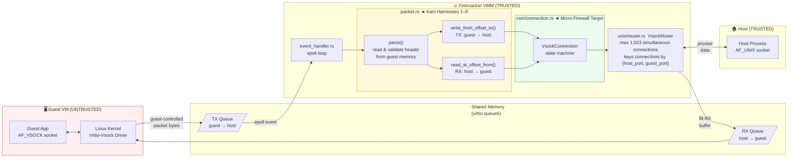
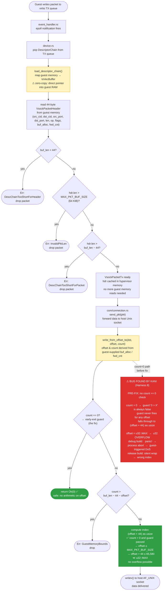
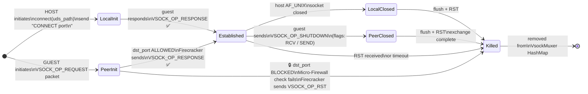

# Firecracker Vsock — Data Flow & Verification Motivation

Three diagrams in order of zoom level:
1. **System architecture** — trust boundary & attack surface
2. **Packet parser internals** — step-by-step flow with the exact bug location
3. **Connection state machine** — where the micro-firewall is inserted

Render with any Mermaid-compatible viewer (GitHub, VS Code Mermaid Preview, Obsidian, etc.).

---

## Diagram 1 — System Architecture & Trust Boundary

---

## Diagram 2 — Packet Parser: Internal Flow & Bug Location

The parser runs entirely inside the VMM but operates on memory written by the (untrusted) guest.
Fields like `offset` and `count` are derived from guest-supplied header values (`fwd_cnt`, `buf_alloc`).

---

## Diagram 3 — Connection State Machine & Micro-Firewall Hook

The state machine in `csm/connection.rs` drives every individual vsock connection.
The micro-firewall is inserted in the `PeerInit` state — **before** `Established` is reached —
so restricted ports can never complete a handshake.

---

## Summary: Why Formal Verification?

| Layer | What can go wrong | Testing coverage gap | Kani/Verus target |
|---|---|---|---|
| **packet.rs** parser | Integer overflow on `offset + 44` when `count = 0` | Fuzzing unlikely to hit exactly `count=0 && offset≈u32::MAX` | Harnesses 4–8 |
| **packet.rs** header | LE encoding round-trip data loss; wrong `VSOCK_PKT_HDR_SIZE` constant | Unit tests use fixed values, miss all-bits-set edge cases | Harnesses 1–3 |
| **csm/connection.rs** micro-firewall | Port filter bypassed via state transition edge cases | Hard to enumerate all state/packet orderings with tests | Kani / Verus proof |

The key insight: a malicious guest can craft packet headers with arbitrary field values.
Kani explores **all possible u32 inputs simultaneously** and proves the arithmetic is safe — something no finite test suite can do.
